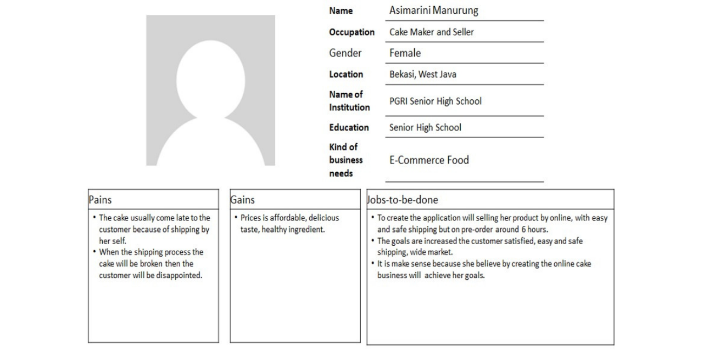

# Client Cake Shop Development 
This is a final project of the Psychology and Design Thinking course that we worked on in a group team called 'Group 10'. This project aims to help our client (the cake shop owner) to develop and solve her problem so basically, we are trying to be her consultant for her business and trying to develop her business, especially on the technology side. 

There are several steps that we do in order to help her to develop her business. The very first step that we must do is to hold the minutes of a meeting to discuss several things with her such as her problem with her marketing, what she wants the kind of system to be, hows her business process, her business model canvas, and her business type. Then, we do the user canvas, decomposition diagram, fishbone diagram, project plan (project owner business goals and project owner indicators of business), increasing the project owner business competitive advantage, business SWOT analysis, business model canvas, business process menu along with all the menu and the items, and UI prototype. 

At the end of the step, we tried to make a conclusion based on what we have already discussed in the meeting earlier with her and we tried to solve all of her problems and decided whether all of her project plans are possible or not to be reach.  

For more detail about what exactly we are doing, you may download and read our report that I have already attached within this repository. 

